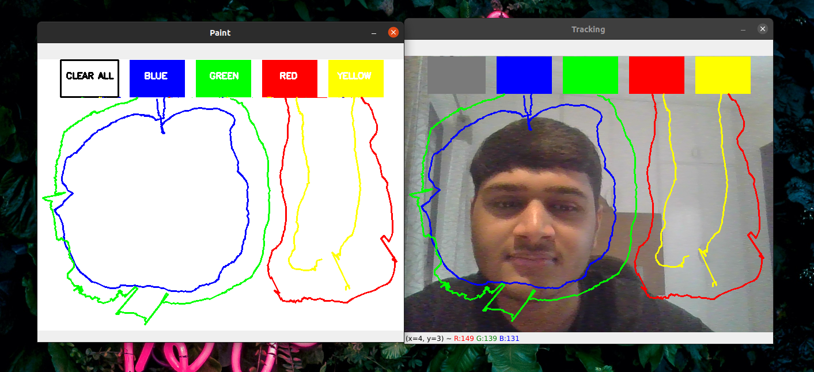

# OpenCV | WebCam Paint
This repo consists of an OpenCV Application that can track an object's movement in the frame, using which a user can draw on the screen by moving the object around, sort of a **WebCam Paint**.

## Project Description
- Given the **Real Time Webcam Data**, this paint-like python application uses **OpenCV** library to track an object-of-interest (a blue pen in this case).
- And then it allows the user to draw by moving the object, which makes it both awesome & challenging to draw simple things.
- The project is divided into **6 Steps**. Let's go through each one of them one by one.

### Step 1 | Initialization
- We import the required libraries, **Numpy** & **OpenCV**, and the **Deque** Data Structure from the **collections** module.
- We have used deque because it completes both the **Insert & Pop** operations in **O(1)** time.
- And then we define all the required variables which we will be using throughout our application.

### Step 2 | Set Up the Paint Interface
- Firstly, we create a **Blank White Image** which will serve as our Paint Window.
- Then we draw 5 boxes on the image, for our 5 different options, **Clear All, Red, Blue, Green & Yellow**, and label them accordingly.
- And at last, we create a window to display the above created image.

### Step 3 | Reading the Video
- In this step, we load the video, more particularly, the **Live Feed** of our webcam.
- And now we loop over the video, frame by frame, and we add the same **Painting Interface** on every frame we created in the last step for user's ease.
- This is the first thing that we do in our **Loop**.

### Step 4 | Finding the Contour of Interest
- The second thing we do in our loop is we try to find the contour of interest in each of the frames. Read more about contours [here](https://opencv-python-tutroals.readthedocs.io/en/latest/py_tutorials/py_imgproc/py_contours/py_contour_features/py_contour_features.html).
- Once we find the contour, we do a series of image operations, such as **Erosion, Morphing & Dilation**. Read more about them [here](https://docs.opencv.org/3.0-beta/doc/py_tutorials/py_imgproc/py_morphological_ops/py_morphological_ops.html).
- After that we use the center of the contour (blue pen) to draw on the screen as it moves.

### Step 5 | Start Drawing & Store the Drawings
- Now we start tracking coordinates of each and every point the center of the contour touches on the screen, along with it's color.
- We store these set of points of different colors in different deques (bpoints, gpoints, etc).
- When the center of the contour touches one of the colored boxes we put on the screen in Step 2, we store the points in it's respective color deque.

### Step 6 | Show the Drawings on the Screen
- After storing all the points in their respective color deques, we join them all using a line of their own color.
- Once we join all the points in each & every frame with a line, we put it on both the windows that we created.
- After falling out of the loop, we release the camera and destroy all the windows.

## Live Example
A live example of the application can be seen in the below image.

## Acknowledgements
I have made this application with the help of a Medium tutorial, which can be found [here](https://towardsdatascience.com/tutorial-webcam-paint-opencv-dbe356ab5d6c).

